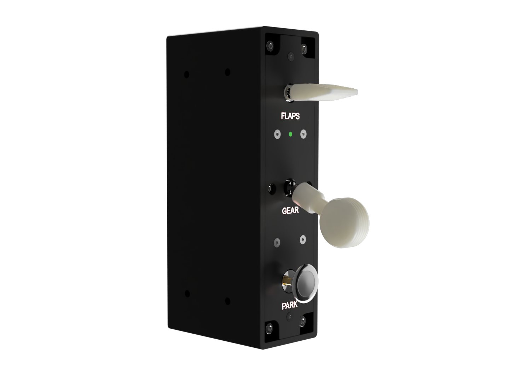

# Nobs Approach

A build-it-yourself lever panel for flight simulators: **3 levers** (Flaps, Gear, Parking Brake)
wired to an **Arduino Nano ESP32**. It plugs in over USB and shows up as a standard game controller
(HID gamepad) named **"Nobs Approach"**, recognised directly by MSFS and the Nobs app with no
drivers to install.

All three levers are 3-position (ON-OFF-ON); each lever's two outer positions are reported as two
buttons, for **6 buttons** total.



## Docs

- **[Which wire goes where](docs/arduino-esp-32-wiring.md)**: the button + pin map. For a visual
  reference alongside it, see the [wiring diagram](docs/wiring-diagram.pdf).
- **[Loading the firmware](firmware/arduino_eps32_nano/README.md)**: first-time flashing and
  re-flashing, step by step.
- **[Setting the device ID & name](docs/board-identity.md)**: how the board names itself, how to
  rename it, and how to run several approach panels at once (each gets its own ID + name).
- **[Bill of materials](docs/bill-of-materials.md)**: parts list.

## Nobs FS Companion App

The [**Nobs FS app**](https://github.com/ibovegar/nobs-fs-app) is the companion application for
communicating with and configuring this panel. It automatically detects the Nobs Approach by its
USB identity (VID `303A` / PID `80F8`), so the right device is selected even when other game
controllers are connected.

Use it to:
* **Verify wiring & test inputs:** watch every lever position register live as you move it, handy
  for confirming the build before binding anything in the sim.
* **Track multiple approach panels:** the Devices page lets you add extra instances of the panel,
  each with its own ID and name (see [Setting the device ID & name](#setting-the-device-id--name-in-brief)
  below), so the app and the sim can tell them apart.

See the app repository for installation and usage details: <https://github.com/ibovegar/nobs-fs-app>

## Setting the device ID & name (in brief)

The board's name and USB product ID aren't compiled in; they're stored on the board, so the same
firmware can be set up as any Nobs profile. Out of the box this is **"Nobs Approach"** (`303A` /
`80F8`). To change it, the configuration app sends a single line over the board's serial port:

```
SET_ID:80F8:Nobs Approach
```

The board saves the new name + ID, replies `OK:80F8:Nobs Approach`, and reboots so it takes effect
(`GET_ID` reads back the current values). For multiple approach panels, give each one the next ID in
the block, e.g. `SET_ID:80F9:Nobs Approach 2`. Full details, including the Windows name-cache
refresh, are in **[docs/board-identity.md](docs/board-identity.md)**.
